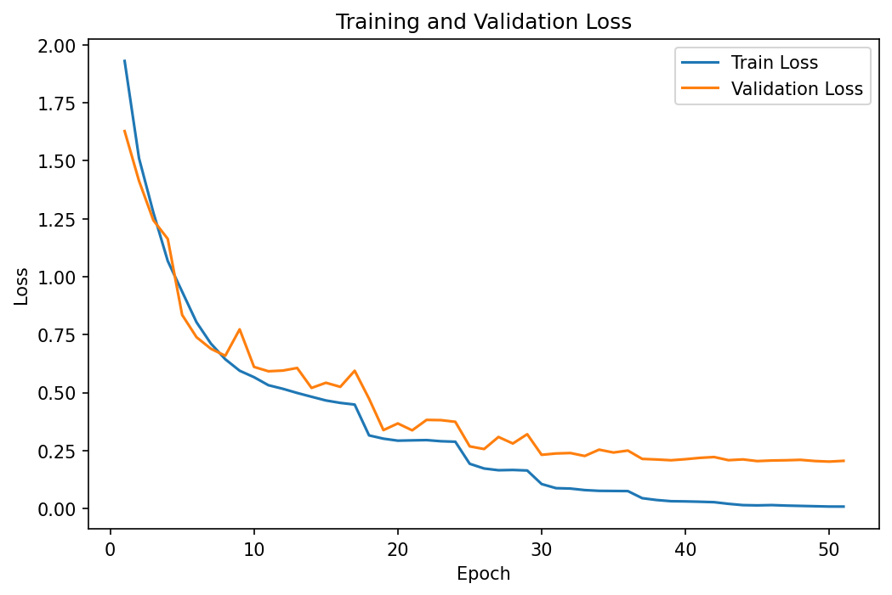
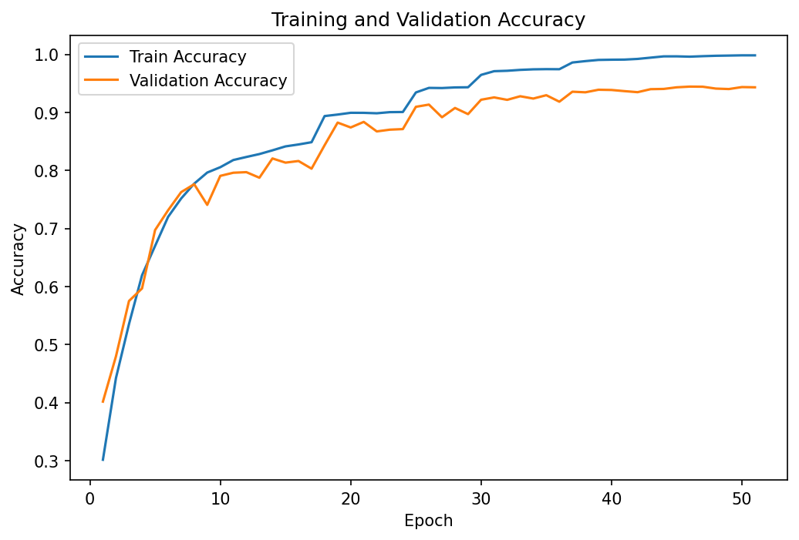
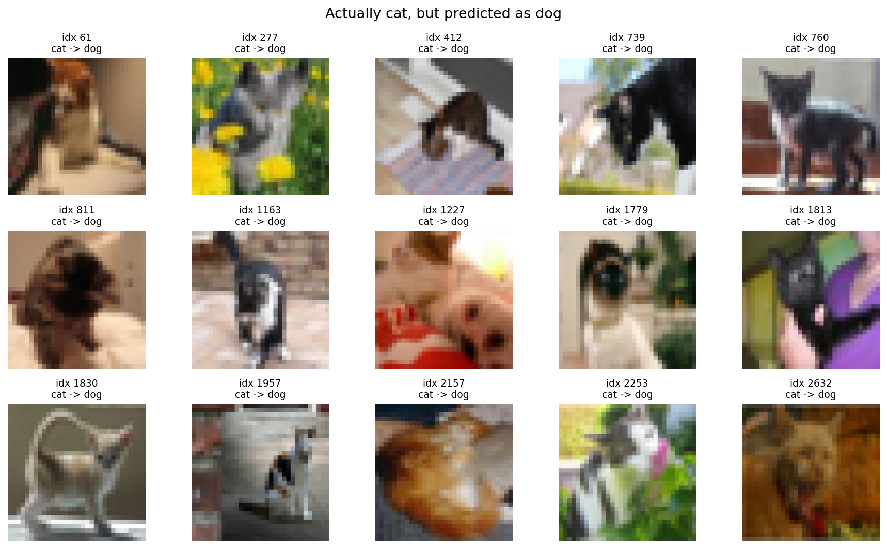
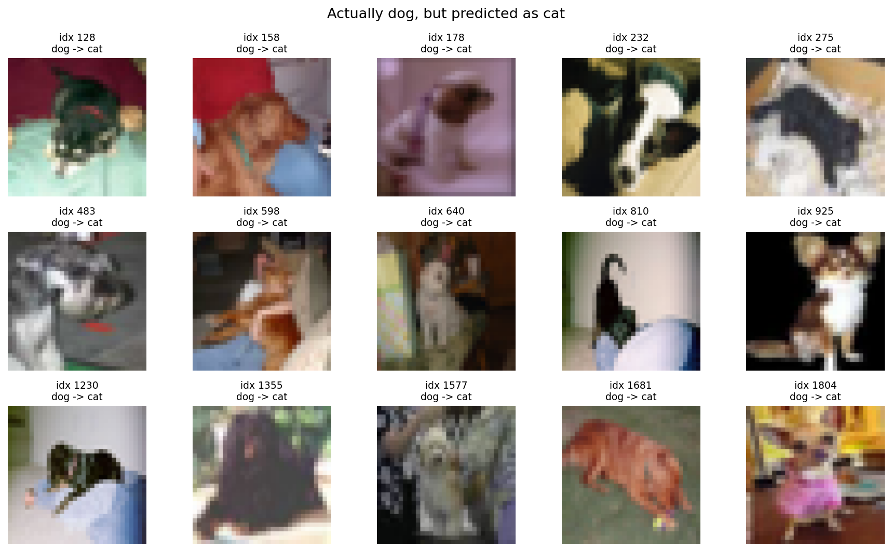

# ResNet-18 + CIFAR-10 分类实战

手写 ResNet-18，在 CIFAR-10 数据集上完成 10 分类，并在三张 GPU 上并行训练。

## 项目结构

```
resnet_cifar10/
├── config.py       # 所有超参数、数据路径、模型保存路径
├── dataset.py      # CIFAR-10 加载、数据增强、训练/验证/测试划分
├── model.py        # BasicBlock + ResNet-18 网络定义
├── train.py        # 训练主流程（多 GPU、早停、保存最优模型）
├── test.py         # 测试集评估、每类准确率、混淆矩阵
├── predict.py      # 单张图片预测
├── plot.py         # 根据训练历史绘制 Loss / Accuracy 曲线
├── analyze_errors.py  # 找出测试集预测错误的图片并可视化
├── loss_curve.png
├── accuracy_curve.png
├── error_cat_as_dog.png
├── error_dog_as_cat.png
└── training_history.pth
```

## 运行方法

```bash
conda activate pytorch

# 训练（默认使用全部可用 GPU，最多 100 轮，连续 5 轮不提升自动停止）
python train.py

# 查看测试集结果
python test.py

# 绘制曲线
python plot.py
```

## 数据集

使用 CIFAR-10，共 10 个类别：飞机、汽车、鸟、猫、鹿、狗、青蛙、马、船、卡车。

| 集合 | 数量 |
|---|---:|
| 训练集 | 45000 |
| 验证集 | 5000 |
| 测试集 | 10000 |

训练集使用随机裁剪（padding=4）和随机水平翻转做数据增强，验证集、测试集只做归一化。

## 网络结构

手写的 CIFAR-10 版 ResNet-18（参数量约 11.17M）：

```
input (3 x 32 x 32)
  -> Conv3x3(3->64) + BN + ReLU
  -> Layer1: 2 x BasicBlock   (64 ch,   32x32)
  -> Layer2: 2 x BasicBlock   (128 ch,  16x16)
  -> Layer3: 2 x BasicBlock   (256 ch,  8x8)
  -> Layer4: 2 x BasicBlock   (512 ch,  4x4)
  -> GlobalAvgPool -> Flatten
  -> Linear(512 -> 10)
```

每个 BasicBlock 由两条 3x3 卷积 + BN + ReLU 构成，并把输入通过跳跃连接直接加到输出上：

```
y = F(x) + x
```

当通道数或特征图尺寸改变时，用 1x1 卷积 + BN 对 `x` 做 downsample，保证可以相加。

## 训练配置

| 配置项 | 值 |
|---|---|
| 优化器 | SGD（momentum=0.9, weight_decay=5e-4）|
| 初始学习率 | 0.1 |
| 学习率调度 | ReduceLROnPlateau（连续 2 轮不降则减半）|
| Batch Size | 128 |
| 最大轮数 | 100 |
| 早停 | 连续 5 轮验证集无提升 |
| GPU | 3 x GTX 1080 Ti（DataParallel）|

训练在第 51 轮触发早停并结束，最佳验证集准确率 **94.44%**。

## 实验结果

### Loss 曲线



### Accuracy 曲线



### 测试集结果

| 指标 | 值 |
|---|---:|
| 测试集 Loss | 0.2487 |
| 测试集准确率 | **93.66%** |

各类别准确率：

| 类别 | 准确率 |
|---|---:|
| airplane | 94.40% |
| automobile | 97.60% |
| bird | 90.60% |
| cat | 87.50% |
| deer | 95.00% |
| dog | 88.80% |
| frog | 94.30% |
| horse | 95.90% |
| ship | 96.30% |
| truck | 96.20% |

最容易混淆的是猫和狗：模型经常把猫认成狗（51 次），因为两者在颜色、纹理、姿态上本来就比较接近。误分类主要集中在这两类，说明对相似类别的区分能力还有提升空间。

## 错误分析：模型最容易在哪里犯错

运行 `python analyze_errors.py` 会遍历整个测试集，找出所有预测错误的图片，并自动生成"猫被认成狗""狗被认成猫"的样例图。

测试集共 634 张预测错误，最容易混淆的类别对：

| 真实类别 → 预测类别 | 错误次数 |
|---|---:|
| dog → cat | 75 |
| cat → dog | 51 |
| truck → automobile | 24 |
| bird → deer | 22 |
| airplane → ship | 21 |
| frog → cat | 20 |
| ship → airplane | 20 |
| cat → deer | 19 |

狗被认成猫（75 次）比猫被认成狗（51 次）更多，说明模型对"猫"这个类别的判定范围偏宽。下图是从两组错误中各挑出的 15 个样本（图片下方标注：真实类别 → 预测类别）：





观察这些错误样本可以发现两个规律：一是错误集中在**外形相近的类别**上，比如狗/猫、卡车/汽车、飞机/轮船；二是很多错误图片本身**背景杂乱、只露出半个身体、姿态刁钻**，在 32×32 的低分辨率下，这类图片本来就非常难判断。

## 从 AlexNet 到 ResNet：经典 CNN 演进主线

在动手写 ResNet 之前，我先把 AlexNet、VGG、NiN、GoogLeNet 这条线串了一遍。它们其实是在解决三个依次递进的问题：

**网络先从"浅"变"深"（AlexNet → VGG）**

- AlexNet 证明了"更深的卷积网络"是可行的：ReLU 解决梯度衰减、Dropout 和随机裁剪/翻转抑制过拟合，让 CNN 第一次在大规模图像分类上碾压传统方法。
- VGG 把"加深"变成了标准化操作：用多个 3x3 小卷积堆叠代替大卷积核。两个 3x3 等价于一个 5x5，三个 3x3 等价于一个 7x7，但参数更少、中间多几次非线性，网络可以放心地变深。

**再解决"深了怎么省参数、看得全"（NiN → GoogLeNet）**

- 网络变深后参数和过拟合风险跟着变大。NiN 用 1x1 卷积做跨通道的特征融合和通道压缩，又用全局平均池化替代尾部全连接层，用几乎为零的参数输出类别，从根上减少过拟合。
- GoogLeNet 的 Inception 模块把不同尺寸的卷积和池化并行放几条路，让网络同时"看得细"也"看得全"；每条路开头再用 1x1 卷积压缩通道，控制计算量。NiN 的 1x1 卷积在这里变成了控制开销的工具。

**最后解决"到底能有多深"（ResNet）**

- 前两个问题解决后，剩下的瓶颈变成了：网络堆到几十层时梯度传不回去，训练不动。ResNet 的跳跃连接让梯度有路可走，残差块学不动时可以退化成恒等映射，深度优势才真正被释放出来。

所以 ResNet 不是突然出现的技巧，而是顺着"让网络更深、更深之后怎么控制参数和感受野、以及如何让深度真正可训练"这条逻辑自然走到的一步。

## 个人对残差网络的理解

通过手写 BasicBlock 并在 CIFAR-10 上完成训练，我对残差网络有了比较具体的理解：

1. **深度本身有用，但普通深网络训不动。** 越深的网络理论上能一层层组合出越抽象的特征，但普通网络反向传播时，梯度要连续经过很多层卷积权重，越传越弱，最后浅层几乎学不到东西，网络就退化了。深度带来的不是"变笨"，而是"优化困难"。
2. **跳跃连接让梯度有了一条近路。** 残差块输出 `y = F(x) + x`。反向传播时，`x` 的梯度可以沿跳跃连接直接传回浅层，不需要每次都穿过卷积层，因此梯度消失被明显缓解。
3. **残差块允许"偷懒"。** 每个块不再被迫学完整的映射 `H(x)`，而只学残差 `F(x) = H(x) - x`。如果这个块没有可学的东西，它可以把 `F(x)` 学到接近 0，输出约等于 `x`，相当于什么都没做但也没把网络变差，这是深层网络能稳定加深的关键。
4. **代码里的细节让理解更具体。** 我自己实现时最需要注意的是 `downsample`：当 `stride=2` 或通道数变化时，跳跃连接上的 `x` 也必须经过 1x1 卷积 + BN，尺寸才能和 `F(x)` 对齐后相加。
5. **深度不是越深越好。** 在 CIFAR-10 这种小数据集上，ResNet-18 已经接近任务的"甜点区"；残差连接的优势在 ImageNet 这类更大更复杂的任务、以及几十上百层的网络中才体现得更明显。

整体收获：ResNet 不是发明了"更深的网络"，而是发明了一种**让网络敢变深**的结构。
